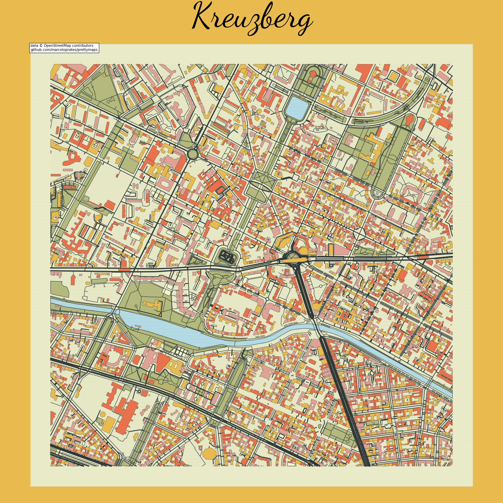

# prettymaps

[Prettymaps](https://github.com/marceloprates/prettymaps) is a Python package created by Marcelo Prates that utilizes [osmnx](https://github.com/gboeing/osmnx), [matplotlib](https://matplotlib.org/), [shapely](https://shapely.readthedocs.io/en/stable/index.html) and [vsketch](https://github.com/abey79/vsketch) packages to create maps with customizable styles from [OpenStreetMap](https://www.openstreetmap.org/#map=12/11.0733/106.3078) data.


# Installation

### Activate your conda enviromment. In my case: 

```
conda activate prettymaps

```

### And install using [conda](https://anaconda.org/conda-forge/prettymaps):

```
conda install -c conda-forge prettymaps

```

# Example 

### Import prettymaps and matplotlib

```
import prettymaps
import matplotlib
from matplotlib.font_manager import FontProperties
from matplotlib import pyplot as plt

```
### And run

```
# Create matplotlib figure
fig, ax = plt.subplots(figsize = (20, 20), constrained_layout = True)

# Prettymaps
plot = prettymaps.plot(
    # Coordinates 
    (52.4987351,13.4152121),
    radius = 1000,
    # Matplotlib axis
    ax = ax,
    # OSM layers 
    layers = {
        "green": {
            "tags": {
                "landuse": "grass",
                "natural": ["island", "wood"],
                "leisure": "park"
            }
        },
        "forest": {
            "tags": {
                "landuse": "forest"
            }
        },
        "water": {
            "tags": {
                "natural": ["water", "bay"]
            }
        },
        "parking": {
            "tags": {
                "amenity": "parking",
                "highway": "pedestrian",
                "man_made": "pier"
            }
        },
        "streets": {
            "width": { 
                "motorway": 3,
                "trunk": 3,
                "primary": 2.5,
                "secondary": 3,
                "tertiary": 2,
                "residential": 1.5,
            }
        },
        "building": {
            "tags": {"building": True},
        },
    },
    style = {
        "background": {
            "fc": "#F2F4CB",
            "ec": "#dadbc1",
            "hatch": "ooo...",
        },
        "perimeter": {
            "fc": "#F2F4CB",
            "ec": "#dadbc1",
            "lw": 0,
            "hatch": "ooo...",
        },
        "green": {
            "fc": "#bcb46d", 
            "ec": "#2F3737",
            "lw": 1,
        },
        "forest": {
            "fc": "#bcb46d", 
            "ec": "#2F3737",
            "lw": 1,
        },
        "water": {
            "fc": "#d0e4e2", 
            "ec": "#2F3737",
            "hatch": "ooo...",
            "hatch_c": "#85c9e6",
            "lw": 1,
        },
        "parking": {
            "fc": "#F2F4CB",
            "ec": "#2F3737",
            "lw": 1,
        },
        "streets": {
            "fc": "#2F3737",
            "ec": "#475657",
            "alpha": 1,
            "lw": 0,
        },
        "building": {
            "palette": [
                "#e9ba4e", 
                "#E9724C",
                "#e0a295"
            ],
            "ec": "#2F3737",
            "lw": 0.5,
        }
    }
)

# Change background color
fig.patch.set_facecolor('#e9ba4e')

# Add title
plt.title('Kreuzberg', 
          x=0.5, 
          y=1.0,
          fontproperties = FontProperties(
        #You can download it from Google Fonts 
        fname = '../assets/DancingScript-VariableFont_wght.ttf',
        size = 100)
)
# Save figure
plt.savefig('../prints/kreuzberg.png')

```


